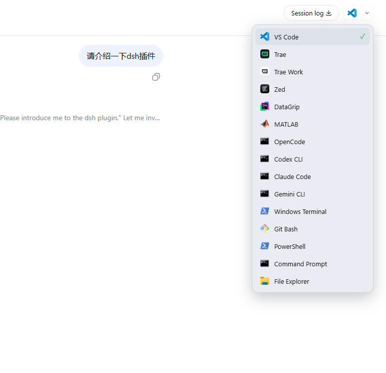
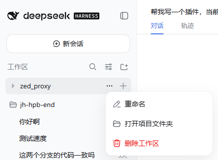

# dsh-open-project

[English](README.md) | 中文

在会话页头右上角用一个编辑器、IDE、终端或文件管理器打开当前项目文件夹——或者从左侧
工作区「…」菜单打开某个工作区的文件夹。插件往会话作用域的
`conversation.session.header.utilities` 列表贡献一个小的拆分下拉，并在工作区溢出菜单里
加入一行 **「打开项目文件夹」**。下拉框会在主机上从一个**较完整的目录**中扫描实际安装的
代码编辑器、IDE、终端与文件管理器 —— VS Code、VSCodium、Cursor、Trae、Trae Work、Zed、
Windsurf、Sublime Text、Notepad++、JetBrains 系列、Eclipse、NetBeans、Qt Creator、
OpenCode、Codex、Claude Code、Aider、Gemini CLI、Neovim、Helix、Micro、Vim、
Windows Terminal、Alacritty、WezTerm、Tabby、Warp、ConEmu、Cmder、PowerShell 7、
Git Bash，以及 Total Commander 等文件管理器 —— 以及永远存在的 PowerShell、Command
Prompt 与 File Explorer，只列出检测到的那些。选择某一项后，用该应用打开当前会话的
工作目录（`cwd`）。

检测是**动态的且按平台自适应**：只有在主机上真正解析到该应用的执行文件/命令才会出现，
因此某台机器没装某个编辑器，下拉框里就不会显示它。在 Windows 上用 PowerShell 探查
App Paths 注册表、PATH 命令、常见安装路径与卸载注册表，并为每个启动器提取**真实产品图标**；
在 Linux/macOS 上通过宿主 subprocess 服务解析 PATH 命令与常见安装路径，这些条目不带图标，
浏览器退化为字母徽标。

Host 半包负责检测、图标提取与进程启动；浏览器半包负责下拉框、它的交互状态（开/关、
已加载应用列表）、当前选中的应用与样式表。二者通过包私有的 Client→Host RPC 通信：
`list-apps` 与 `open-with`。

## 界面预览



下拉框列出主机上检测到的每个编辑器、IDE、终端与文件管理器。选择某一项后用它打开当前
项目文件夹；勾选标记表示触发器图标在点击时会直接打开的应用。

插件还会在左侧工作区「…」溢出菜单里加入一行 **「打开项目文件夹」**，位于「重命名」
与「删除工作区」**之间**，使用 DSH 自带的描边文件夹图标：



该行与原生菜单行完全一致——同样的行高、同样的图标风格，鼠标划过不会关闭菜单——并跟随
DSH 当前语言（中文 / English）。点击它用系统文件管理器打开该工作区的文件夹。

## 行为约定

| 入口 | 结果 |
|---|---|
| 页头触发器 | 会话页头右缘的拆分控件。**图标**显示当前将使用的应用（**上次打开的应用**，或默认第一个检测到的应用），**点击图标直接打开**该应用；图标右侧的小箭头用于切换下拉框。 |
| 下拉列表 | 一个美化后的弹层，每个检测到的应用一行，带真实产品图标、名称，并在当前选中的应用上打勾。检测中显示加载占位；无匹配时显示「未检测到可用应用」。 |
| 选择一个应用 | 请求 Host 半包用该项目文件夹启动该应用，记住本次选择（`localStorage`，键 `dsh.open-project.last`），移动勾选并关闭菜单；触发器图标随即显示该应用。 |
| 工作区「…」菜单 | 左侧工作区行的溢出菜单（「…」，即重命名/删除工作区那个菜单）里，在「重命名」与「删除工作区」**之间**新增一个 **「打开项目文件夹」** 行，图标用 DSH 自带的描边文件夹图标（`IconFolderOpenOutline16`，与「重命名」/「删除工作区」的铅笔/垃圾桶同风格），高度与原生行一致，鼠标划过不会关闭菜单。点击用系统的文件管理器打开该工作区的文件夹。DSH 在工作区菜单上是硬编码的，在 0.1.1-rc.2 没有为此暴露插件槽，因此该行通过 DOM/React-root 适配器挂到弹层菜单中，并由宿主 `open-workspace-folder` 端点按工作区标题解析路径。 |
| 点击外部 / Esc | 关闭下拉框。 |

所有界面文案（页头下拉与工作区菜单行）都跟随 DSH 当前语言：插件通过 `locale`
服务注册了自己的 `open-project` 语言包（中文 + 英文），因此把 DSH 在中文与
English 之间切换时，文案会即时更新。

在 Windows 上检测结果始终包含 PowerShell、Command Prompt 与 File Explorer，
因为它们在所有 Windows 主机上都存在。检测结果在本次插件运行期内缓存，因此再次打开是
即时的。

### 启动映射

每个检测到的应用带一个 `mode`，决定它如何被打开：

| 启动模式 | 行为 | 示例 |
|---|---|---|
| `gui` | `exe <项目>` —— 应用自己打开该文件夹（Windows/Linux/macOS 通用） | VS Code、VSCodium、Cursor、Trae、Zed、Sublime、Notepad++、DataGrip、IntelliJ、PyCharm、GoLand、WebStorm、PhpStorm、CLion、Rider、Android Studio、Eclipse、NetBeans、Qt Creator |
| `term` | CLI 工具在终端里运行 —— Windows 为 `wt.exe -d <项目> <命令>`，Linux 为 `gnome-terminal --working-directory=<项目> -- <命令>`，macOS 为 `open -a Terminal <项目>` | OpenCode、Codex、Claude Code、Aider、Gemini CLI、Neovim、Helix、Micro、Vim、Alacritty、WezTerm、Tabby、Warp、ConEmu、Cmder |
| `shell` | shell 在项目目录启动 —— Windows 经 Windows Terminal，Unix/macOS 用默认终端 | PowerShell、PowerShell 7、Command Prompt、Git Bash、Zsh |
| `terminal` | 在项目里打开终端应用 —— Windows 为 `wt.exe -d <项目>`，Linux 为 `gnome-terminal --working-directory=<项目>`，macOS 为 `open -a Terminal <项目>` | Windows Terminal、GNOME Terminal、Konsole、xterm |
| `explorer` | `exe <项目>` —— 打开文件夹本身 | File Explorer、Files (Nautilus)、Nemo、Dolphin、Thunar、Total Commander |

GUI 应用与文件管理器在每个平台都用文件夹参数直接拉起。终端、shell 与 CLI 条目会经由
一个终端打开（Windows 用 Windows Terminal，Unix/macOS 用默认终端），从而拥有独立窗口并
在项目目录启动；Unix/macOS 的终端拉起为尽力而为，默认 `gnome-terminal`/macOS `Terminal`。
插件不会等待被启动的进程退出，因此打开编辑器不会阻塞会话。

在 Windows 上，检测会探查 App Paths 注册表、PATH 命令、常见安装位置与卸载注册表，
并用 `System.Drawing.Icon.ExtractAssociatedIcon` 为每个应用提取图标，以
`data:image/png;base64,` URL 返回。在 Linux/macOS 上，检测通过宿主 subprocess 服务解析
PATH 命令与常见安装路径，且不返回图标，因此那些条目在浏览器中退化为字母徽标。无论何种
平台，某台机器上的确切目录都取决于它实际装了哪些。

## 组合

```yaml
- insert:
    - id: dsh-open-project
      name: dsh-open-project
```

本包把功能贡献到最右侧的 `conversation.session.header.utilities` 列表，与标题旁
`conversation.session.header.actions` 中的操作相互独立。它要求对话 UI 包存在（由其
拥有页头槽位），并要求 Host 提供用于检测与启动的 `subprocess` 服务。

## 安装

```sh
# 从 GitHub 安装
dsh plugin --profile web add github:will00768-max/dsh-open-project
```

安装完成后重启 dsh web：

```sh
dsh web
```

然后刷新浏览器页面即可使用。

如果你是从 DeepSeek Harness 源码运行：

```sh
pnpm dsh plugin --profile web add github:will00768-max/dsh-open-project
pnpm dsh web
```

### 本地开发

```sh
dsh plugin --profile web add <path-to-this-checkout>
```

本地修改后重启 dsh web，以加载最新的插件代码。

遵循 DSH 插件命名约定：仓库与 npm 包命名为 `dsh-open-project`（`dsh-<feature>`）。
若你要发布到自己拥有的 npm scope，凭据与 `dsh.client` 扫描都按该精确的包 `name` 键控。

## 模型体验

### 页头下拉框

#### 模型看到什么

无。下拉框是浏览器端控件，它的状态（开/关、检测到的应用列表）不会进入模型历史。

#### Token 影响

为零。该控件不创建模型轮次。

#### KV Cache 影响

无。它不改变派生的请求前缀。

## 已知限制与暂缓事项

- **图标仅限 Windows 且为尽力而为。** 在 Windows 上图标来自真实可执行文件（经
  `System.Drawing`），来源是已安装应用的图标（32×32）。Windows Terminal 的 `wt.exe`
  App Execution Alias 没有可提取的产品 Logo，因此 Windows Terminal 条目复用 PowerShell
  图标，以保持终端组在视觉上一致。在 Windows 上，作为 `.ps1` shim 检测到的 CLI 工具
  （OpenCode、Codex、Claude Code、Gemini CLI 等）使用 cmd.exe 的控制台图标；在
  Linux/macOS 以及其它无宿主图标的条目上，浏览器退化为字母徽标。
- **加载时重新检测。** 新安装的编辑器只在插件重新加载（或页面刷新后的下一次运行）后
  出现。目录较全但并非穷尽：要新增 Windows 启动器，在 `src/detect.ps1` 的 `$catalog`
  表里补充 id、label、mode 与探查来源；要新增 Unix 启动器，在 `src/index.js` 的
  `UNIX_CATALOG` 中加一条即可。
- **没有按应用配置。** 没有 UI 可添加自定义命令或隐藏已检测到的应用。目录固定为上述
  启动器。
- **Unix/macOS 的终端拉起是尽力而为。** Windows 上终端、shell 与 CLI 条目在安装了
  Windows Terminal 时经由它打开。Unix/macOS 上默认使用 `gnome-terminal`（Linux）/macOS
  `Terminal`；如果不可用，拉起可能失败。GUI 应用与文件管理器在每个平台都会用文件夹参数
  直接拉起。
- **选中的应用是按浏览器的。** 上次选择保存在 `localStorage` 中，因此在同一浏览器内的
  各会话之间共享，但不会跨浏览器或跨机器共享。
